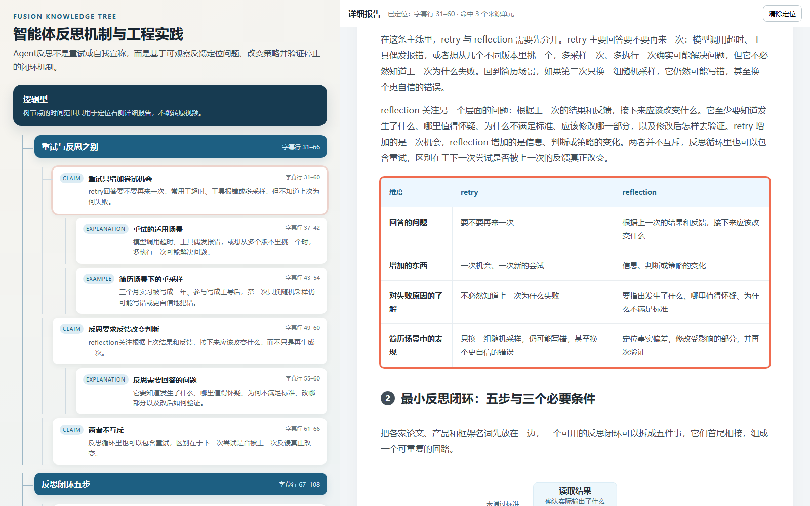

# Fusion Video Pipeline

把 B 站现有字幕或本地字幕转换为可快速浏览的知识树与详细阅读报告，并可选择归档到 Obsidian。
项目以个人 v7 管道为结构化笔记基线，并将
[`imexlovery/video-report-agent`](https://github.com/imexlovery/video-report-agent) 作为外部依赖接入。
一份带来源 ID 的 canonical transcript 同时产出：

1. v7 风格的树形 Markdown 笔记与确定性 SVG/PNG 导图；
2. 可交互 HTML 阅读报告与长 PNG；
3. 一套统一归档到 Obsidian 的成品与可追溯素材。



## 项目特点

- **先骨架、后填充：**同一 LLM 先识别主题、规范术语并比较候选组织轴，再锁定主分支填充内容，避免按字幕顺序不断新开分支。
- **两种互补产物：**知识树用于快速筛选兴趣点，详细报告用于继续阅读；点击树节点可定位到报告中的对应段落。
- **可观测运行：**网页展示实时阶段进度，并保留本地生成历史；每次运行记录模型、耗时、token、请求次数与可得的成本信息。
- **确定性质量门槛：**程序检查 JSON 结构、父节点引用、层级连续性、内容清单归属与页面文字溢出，不以这些检查冒充语义正确性。

## 明确边界

- 只抓 B 站现成 CC 字幕；没有字幕时明确失败，不使用本地 faster-whisper fallback。
- 不启用第二个 LLM 或按风险触发的语义校验。
- 树生成采用 Axis First：同一个 DeepSeek 先通读全文，完成术语规范、核心内容清单和 2–3 个候选
  组织轴的比较，再按选定轴生成主干；第二次调用锁定主干并填充内容，不沿字幕顺序边读边长树。
- 保留结构/Schema、来源 ID 与页面布局检查，这些是确定性校验，不会篡改语义。
- 默认使用 DeepSeek；密钥只从环境变量或现有 Hermes 配置读取，不写进项目。

## 使用

### 环境与安装

当前集成使用 Python 3.12，并要求系统可调用 Node.js 22、Pi 和 Chromium/Playwright。由于上游项目没有
发布为本项目可直接安装的包，请把两个仓库放在同一父目录：

```text
workspace/
├── video-report-agent/   # external upstream dependency
└── subtitle-knowledge-pipeline/
```

```powershell
git clone https://github.com/imexlovery/video-report-agent.git
git clone https://github.com/shakeshakehin/subtitle-knowledge-pipeline.git
cd subtitle-knowledge-pipeline
uv sync --dev
```

复制 `.env.example` 为 `.env`，或直接在 shell 中设置模型环境变量；不要把真实密钥提交到 Git。

### 启动与生成

启动本地网页（默认 `http://127.0.0.1:8766/`）：

```powershell
.\run-fusion.ps1 serve
```

### 受保护的外网预览

公开 GitHub 仓库中的 `video-report-agent` 是核心管道；其线上网站的账号、配额、Web 路由与部署属于
作者未公开的 Service 仓库。本项目只参考“单入口、模式选择、阶段进度、历史报告”的产品结构，前端与
服务端实现均为独立代码，不复制其私有网站源码。

把访问凭据放入未跟踪的 `.env`，密码至少 16 个字符：

```dotenv
FUSION_ACCESS_USERNAME=your-name
FUSION_ACCESS_PASSWORD=use-a-long-random-password
```

然后只监听回环地址，并通过提供 HTTPS 的反向代理或隧道转发：

```powershell
.\run-fusion.ps1 serve --public-mode --host 127.0.0.1 --port 8766 --no-browser
cloudflared tunnel --url http://127.0.0.1:8766
```

Windows 上也可以一次启动管道网站、评测页面和临时 Tunnel；它们会作为隐藏的独立后台进程运行，
不会依赖当前终端或 Codex 对话持续打开：

```powershell
.\start-web-services.ps1
.\status-web-services.ps1
# 不再需要时：.\stop-web-services.ps1
```

外网模式会启用站内登录与 12 小时安全会话、限制等待／运行任务数量、锁定模型 Base URL 与报告 Provider、禁止网页
覆盖服务器的 Obsidian 路径，并对生成 HTML 添加浏览器沙箱和安全响应头。临时 Tunnel 地址会变化；长期
作品展示应改用带域名、访问策略和持久化配置的正式部署。不要把无 TLS 的端口直接映射到公网。

网页支持 B 站链接或本地字幕，并可单独选择“知识树”“详细总结”或同时生成。两者同时生成时，
点击左侧树节点会依据共享的 `source_units` 及其字幕时间范围，在右侧详细报告中滚动并高亮对应内容。
这里的时间范围只用于报告内部定位，不跳转原视频。API Key 输入只存在于当前服务进程内存中。

处理 B 站视频：

```powershell
.\run-fusion.ps1 run BVxxxxxxxxxx
```

复用已有字幕：

```powershell
.\run-fusion.ps1 run "E:\path\subtitle.txt" --title "视频标题" --source-url "https://..."
```

可用 `--output tree|report|both` 选择产物，`--report-mode brief` 生成较短的视觉报告，`--force`
忽略字幕缓存，`--no-publish` 只在本工作区生成。

只重建某次运行的树形笔记和导图，不重跑阅读报告：

```powershell
.\run-fusion.ps1 rebuild-tree ".\runs\<运行目录>"
```

树生成仍是同一模型的两次串行调用。第一步把 `term_normalizations`、`content_inventory`、
`candidate_axes`、`selected_axis` 和主干保存为 `skeleton.json`；第二步锁定组织轴与主干，生成
`outline.json`。每个 point 保存 `id`、`parent_id`、`level`、`kind`、`relation_to_parent`、
`inventory_ids`、短 `title` 与完整 `detail`。

分支数、节点数和深度不再作为硬质量标准，由内容和选定组织轴决定。程序只检查可以确定的事情：
组织轴是否来自候选、核心内容是否进入且只进入一个主分支、父节点是否真实存在、层级是否连续、
父子关系类型是否合法，以及 `coverage` 是否逐项记录核心内容的保留和非核心内容的舍弃理由。
这些检查不调用第二个评审模型，也不把来源 ID 当作语义正确的证明。
来源 ID 保留在结构 JSON 和交互页面的数据层，用于树与详细报告联动；Markdown 笔记与导图不展示
原始字幕证据或 unit 编号。

第一阶段把 `core` 限定为“删除后会破坏全文主线或选定组织轴”的内容，细节、建议和例子分别降为
`supporting` / `optional`；第二阶段允许一个节点合并承载多个非核心清单项。完全相同的术语规范行
会由程序合并，不会为可机械修复的重复项重新调用模型；只有同一原词被解释成冲突术语时才重试。

`summary` 是独立必填成果，会固定写入 Markdown 的“总结”章节，并作为导图末尾的总结分支。
SVG 使用 v7 的中英文像素宽度估算和动态卡片尺寸；每次生成后还会在浏览器里检查所有文字边界，
发现溢出就停止发布。

## 产物

- `runs/<时间-来源>/`：单次运行的完整中间件、日志和两个成果。
- `cache/`：原始字幕规范化后的缓存，重复处理时不再抓字幕。
- Obsidian：`07-AI学习/视频融合成果/<日期>/<来源-标题>/`。

Obsidian 主笔记同时嵌入导图和阅读报告长图，并链接可交互 HTML；`_素材` 保存 canonical transcript、
`skeleton.json`、完整结构 JSON、调用用量、检查结果和运行 trace。

每次运行的 `usage.json` 和网页结果卡会分别标注树生成与详细报告的耗时、token 和模型调用次数；
只有 provider 返回或代码能够可靠估算的价格才显示成本，未知价格会标为未定价。
模型重试的 token 会逐次累加；即使后续渲染失败，已经发生的调用用量也会先写入 `usage.json`。
正常生成仍是两个阶段；若模型输出未通过结构校验，修复重试会关闭隐藏推理，避免重复支付完整规划成本。
复用已有树时，本次 token 与请求数记为 0，并把原始生成用量单独保存在 `reused_generation_usage`，
避免把历史成本重复计入本次任务。

关于上游详细报告究竟做了哪些质量保障、哪些没有做，见
[代码审计](docs/video-report-agent-audit.md)。

## V7 对照评测

项目保留了固定数据集、V7 / Fusion 冻结输出、人工金标准和 A/B 盲测的评测框架。真实字幕、人工标注、
生成结果和评测报告只保存在本地并由 Git 忽略，不随公开仓库分发。评测不会让另一个 LLM 代替人类裁判。
准备自己的数据后运行：

```powershell
.\run-benchmark.ps1 serve
```

介面会先让你只看字幕建立金标准，锁定后才展示隐藏身份的两版结果；支持证据行号、自动保存、完成度
检查、第二评审者和一键导出。完整方法和命令见 [benchmark/README.md](benchmark/README.md)。

## 代码来源与许可边界

本仓库实现知识树生成与校验、树文联动网页、进度与历史、评测工具以及 Obsidian 归档。详细报告生成与
渲染通过外部 `video-report-agent` 调用；本仓库不包含其源代码。经 2026-10-02 检查，上游仓库没有
提供 `LICENSE`、`COPYING` 或 `NOTICE` 文件，因此不能仅因其公开可见便假定可以复制或重新分发。
具体来源、测试版本和边界见 [THIRD_PARTY_NOTICES.md](THIRD_PARTY_NOTICES.md)。

发布前的密钥与隐私检查见 [SECURITY.md](SECURITY.md)。本仓库中由本项目作者拥有权利的代码采用
[MIT License](LICENSE)；该许可不替外部 `video-report-agent` 或其他第三方项目授予权利。
